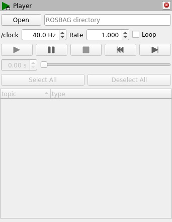
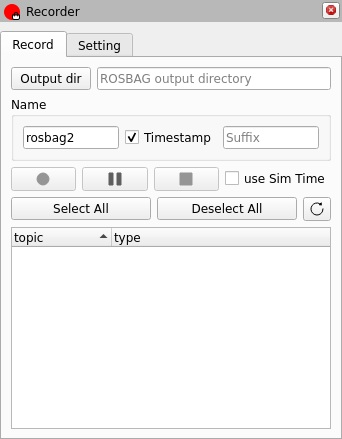
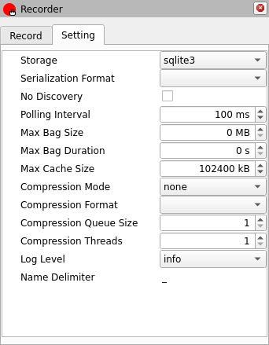

# [RViz2_Bag](https://github.com/shikishima-TasakiLab/rviz2_bag)

Record and play ROSBAG on RViz2.

|Player|Recorder|
| :--- | :--- |
|||

Verified to work with ros2 humble and iron (2024/10/01).

## Player

### Panel

The following table describes the functionality of the Player UI and its correspondence with the standard `ros2 bag play` CLI.

| GUI Control | Description | Equivalent `ros2 bag play` Option/Key |
| :--- | :--- | :--- |
| **Open** | Select the ROS 2 bag directory. | - |
| **/clock** | Publish to `/clock` at a specific frequency (Hz). | `--clock [HZ]` |
| **Rate** | Set the playback speed multiplier. | `-r RATE` / `--rate RATE` |
| **Loop** | Enable continuous looping of the bag file. | `-l` / `--loop` |
|  **Play** | Start playing the selected bag. | `ros2 bag play <bag_path>` |
|  **Pause** | Pause playback. | `Space` |
|  **Stop** | Stop playback. | `Ctrl + C` |
|  **Rewind** | Reset playback to the beginning. | - |
|  **Next Message** | Step forward to the next message. | `.` (while paused) |
| **Spinbox / Slider** | Adjust the current playback position. | `--start-offset <SECONDS>` |
| **Select All** | Enable all topics for publishing. | - |
| **Deselect All** | Disable all topics. | - |
| **Topic Checkbox** | Toggle specific topics to publish. | `--topics <TOPICS>` |

### Service

| Server | Request and Response Structure |
| :--- | :--- |
| **/rviz/rviz2_bag/(Panel Name)/play** | [rviz2_bag_interfaces/srv/Command](rviz2_bag_interfaces/srv/Command.srv) |
| **/rviz/rviz2_bag/(Panel Name)/pause** | [rviz2_bag_interfaces/srv/Command](rviz2_bag_interfaces/srv/Command.srv) |
| **/rviz/rviz2_bag/(Panel Name)/stop** | [rviz2_bag_interfaces/srv/Command](rviz2_bag_interfaces/srv/Command.srv) |

## Recorder

<table>
    <tr>
        <td></td>
        <td></td>
    </tr>
</table>

### Panel

The following table describes the functionality of the Recorder UI and its correspondence with the standard `ros2 bag record` CLI.

#### Record tab

| GUI Control | Description | Equivalent `ros2 bag record` Option/Key |
| :--- | :--- | :--- |
| **Output dir** | Output directory | `-o OUTPUT`, `--output OUTPUT` |
| **Name** | The name of the ROSBAG to output. You can specify the prefix, whether to include a timestamp, and the suffix. | `-o OUTPUT`, `--output OUTPUT` |
|  **Record** | Start recording. | `ros2 bag record` |
|  **Pause** | Pause recording. | `Space` |
|  **Stop** | Stop recording. | `Ctrl + C` |
| **use Sim Time** | Use simulation time for message timestamps by subscribing to the /clock topic. Until first /clock message is received, no messages will be written to bag. | `--use-sim-time` |
| **Select All** | Enable all topics for recording. | - |
| **Deselect All** | Disable all topics. | - |
|  **Reload** | Reload the list of topics. | - |
| **Topic Checkbox** | Toggle specific topics to record. | `[topics]` |

#### Setting tab

| GUI Control | Description | Equivalent `ros2 bag record` Option/Key |
| :--- | :--- | :--- |
| Storage | Storage identifier to be used, defaults to 'sqlite3'. | `-s {sqlite3,my_test_plugin}`, `--storage {sqlite3,my_test_plugin}` |
| Serialization Format | rmw serialization format in which the messages are saved, defaults to the rmw currently in use. | `-f {s,a}`, `--serialization-format {s,a}` |
| No Discovery | Disables topic auto discovery during recording: only topics present at startup will be recorded. | `--no-discovery` |
| Polling Interval | time in ms to wait between querying available topics for recording. It has no effect if "No Discovery" is enabled. | `-p POLLING_INTERVAL`, `--polling-interval POLLING_INTERVAL` |
| Max Bag Size | Maximum size in bytes before the bagfile will be split. Default it is zero, recording written in single bagfile and splitting is disabled. | `-b MAX_BAG_SIZE`, `--max-bag-size MAX_BAG_SIZE` |
| Max Bag Duration | Maximum duration in seconds before the bagfile will be split. Default is zero, recording written in single bagfile and splitting is disabled. If both splitting by size and duration are enabled, the bag will split at whichever threshold is reached first. | `-d MAX_BAG_DURATION`, `--max-bag-duration MAX_BAG_DURATION` |
| Max Cache Size | Maximum size (in bytes) of messages to hold in each buffer of cache.Default is 100 mebibytes. The cache is handled through double buffering, which means that in pessimistic case up to twice the parameter value of memoryis needed. A rule of thumb is to cache an order of magitude corresponding toabout one second of total recorded data volume.If the value specified is 0, then every message is directly written to disk. | `--max-cache-size MAX_CACHE_SIZE` |
| Compression Mode | Determine whether to compress by file or message. Default is 'none'. | `--compression-mode {none,file,message}` |
| Compression Format | Specify the compression format/algorithm. Default is none. | `--compression-format {zstd,fake_comp}` |
| Compression Queue Size | Number of files or messages that may be queued for compression before being dropped. Default is 1. | `--compression-queue-size COMPRESSION_QUEUE_SIZE` |
| Compression Threads | Number of files or messages that may be compressed in parallel. Default is 0, which will be interpreted as the number of CPU cores. | `--compression-threads COMPRESSION_THREADS` |
| Log Level | Logging level. | `--log-level {debug,info,warn,error,fatal}` |
| Name Delimiter | The delimiter to insert between the prefix, timestamp, and suffix of the ROSBAG name to output. | - |

### Service

| Server | Request and Response Structure |
| :--- | :--- |
| **/rviz/rviz2_bag/(Panel Name)/record** | [rviz2_bag_interfaces/srv/Command](rviz2_bag_interfaces/srv/Command.srv) |
| **/rviz/rviz2_bag/(Panel Name)/pause** | [rviz2_bag_interfaces/srv/Command](rviz2_bag_interfaces/srv/Command.srv) |
| **/rviz/rviz2_bag/(Panel Name)/stop** | [rviz2_bag_interfaces/srv/Command](rviz2_bag_interfaces/srv/Command.srv) |

## NOTICE

This plugin contains some modified material from [rosbag2 (Apache License 2.0)](https://github.com/ros2/rosbag2).
